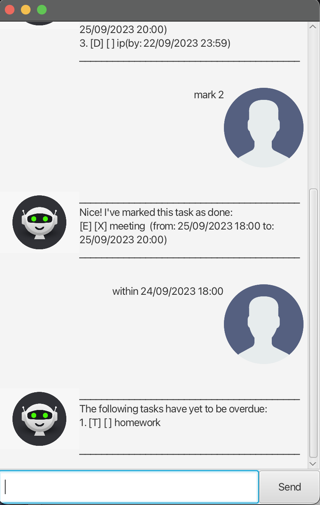

# Bot's User Guide

Welcome to your task manager, Bot! He will help you to keep track of
all your tasks so that you will never forget them again!

- [Quick start](#quick-start)
- [Features](#features)
  - [Adding task](#adding-a-task)
  - [Exit application](#exit-application)
  - [Listing all tasks](#listing-all-tasks)
  - [Deleting a Task](#deleting-a-task)
  - [Marking Task as complete](#marking-task-as-complete)
  - [Marking Task as incomplete](#marking-task-as-incomplete)
  - [Searching for Tasks](#searching-for-tasks)
  - [Finding Tasks to be done within period](#finding-tasks-to-be-done-within-period)

## Quick start


1. Ensure you have Java `11` or above installed on your computer.

2. Download the latest `bot.jar` from [here](https://github.com/XihuaZ/ip/releases/tag/A-Release).

3. Copy the file to the folder you want to use as the home folder for your task manager.

4. Open a command terminal, cd into the folder you put the jar file in, and use the `java -jar bot.jar`
   command to run the app.
   A GUI similar to the below should appear in a few seconds.



## Features

### Adding a Task

There exists three different kind of tasks that can be added:

1. Todo task
2. Deadline task
3. Event task

To add a task, use one of the following commands:

- `todo [task description]`
- `deadline [task description] /by [d/MM/YYYY HH:MM]`
- `event [task description] /from [d/MM/YYYY HH:MM] /from [d/MM/YYYY HH:MM]`

Example:
```
todo Homework 
deadline Assignment /by 5/07/2020 18:30
event Workshop /from 15/07/2020 18:30 /to 25/07/2020 18:30
```

### Exit Application

To exit the application, use:

- `bye`

Example:
```
bye
```

### Listing all Tasks

You can list all the tasks currently saved in the app:

- `list`

Example:
```
list
```

### Deleting a Task

You can remove a task by including its index:

- `delete [task index]`

Note: The task index is based on the index of each task
as shown in [`list`](#listing-all-tasks). It starts from 1 and should
be a positive integer.

Example:
```
delete 2
```

### Marking Task as complete

You can mark a task as complete with its index:

-`mark [task index]`

Note: The task index is based on the index of each task
as shown in [`list`](#listing-all-tasks). It starts from 1 and should
be a positive integer.

Example:
```
mark 3
```

### Marking Task as incomplete

You can mark a task as incomplete with its index:

-`unmark [task index]`

Note: The task index is based on the index of each task
as shown in [`list`](#listing-all-tasks). It starts from 1 and should
be a positive integer.

Example:
```
unmark 2
```

### Searching for Tasks

Find tasks by keywords or dates with:

- `find [keyword]`

Example:
```
find home
```

### Finding Tasks to be done within period

Find tasks that have yet to be marked as complete and are within the time period.
This can be done with:

- `within [d/MM/YYYY HH:MM]`

Example:
```
within 22/09/2023 18:00
```